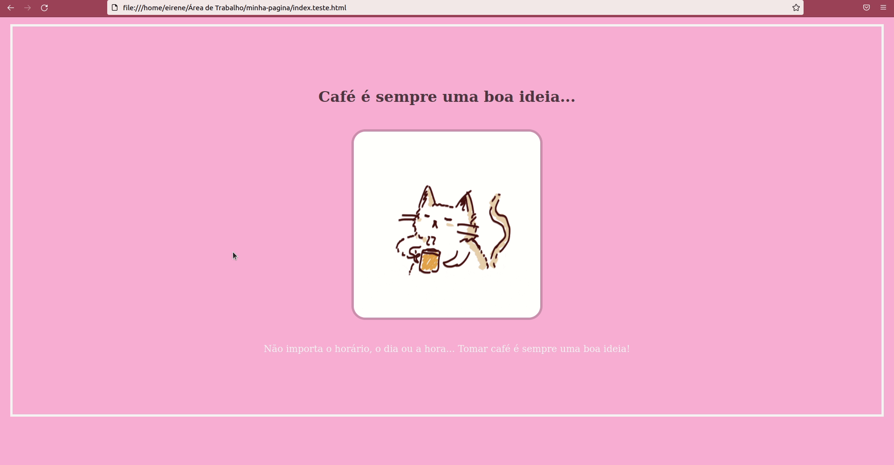

# Projeto para o Artigo "Não fuja do CSS...!"

## INTRODUÇÃO

Você é do time que sai correndo quando pedem para colocar cor em uma div?

Independente da sua resposta, saiba que eu já fui desse time. Eu *odiava* css. Ou pelo menos achava que odiava. Até que um dia, por azar do destino (ou sorte), eu acabei ficando responsável por estilizar as telas de uma aplicação em um hackathon. Diante desse desafio, o único caminho viável para mim era finalmente derrotar meu arqui inimigo css.

**Neste artigo, minha proposta é trazer alguns conceitos bem básicos de css com a estilização de uma página HTML simples.** Conceitos estes que foram o começo da minha saga *enimy to lovers* já que hoje em dia sou completamente apaixonada por css.

[Continuar Lendo...](https://medium.com/orangejuicefc/n%C3%A3o-fuja-do-css-2cb0d512792c)

## Resultados :sparkles:

## Como abrir o projeto?

* Faça o dowload do projeto
* Copie o endereço/caminho do arquivo `index.html` no seu computador e cole em um navegador de sua preferência

 
Made with ☕ & &#128156; by *eirene*

